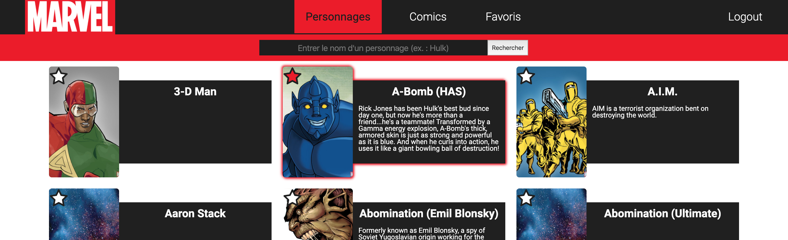

# Marvel frontend

## Features

### Display Marvel Chars



### Display Marvel Comics


### Display Favorites


## How to use

In then project directory :

1. start the marvel backend : [link here](https://github.com/CedricPradels/marvel-backend)

2. create de `.env` file :

```bash
touch .env
echo "REACT_APP_BACKEND_URL=http://localhost:3000" >> .env
```

3. download and install dependencies :

```bash
yarn
```

4. run the project

```bash
yarn start
```
